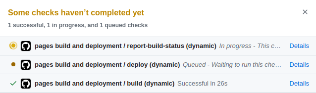

В этом нам помогут GitHub Pages и Jekyll.  
Почему выбран такой вариант:  
- нет необходимости "танцевать с бубном" в консоли, устанавливая зависимости,  
  всё можно сделать прямо в браузере на github.com
- бесплатный хостинг
- базовая тема адапатирована для мобильных устройств

#### Создаём форк
Первым делом создаём форк репозитория barryclark/jekyll-now.
1. Переходим по ссылке https://github.com/barryclark/jekyll-now/fork
2. Выбираем имя репозитория, должно быть `<user>.github.io` или `<organization>.github.io`
   и создаём форк    
   

#### Редактируем конфиг
Теперь нужно изменить минимальные сведения о себе в конфиге.  
1. Открываем файл `_config.yml`
2. Редактируем следующие поля: `name, description, email, github`  
     
3. Коммитим изменения
4. Видим, что сборка и деплой автоматически запустились  
     
   
6. Пару раз обновив страницу, убеждаемся в успешности сборки и деплоя.
   
8. Теперь можем открыть свой блог https://`<user>`.github.io (https://nestersv.github.io/)
   

Технически блог готов, однако надо бы ещё пост добавить.
#### Добавляем пост
Каждый пост отдельный файл. В репозитории уже имеется пример `_posts/2014-3-3-Hello-World.md`
1. Открываем его для редактирования. Или создаём новый файл в папке `_posts/`
2. Меняем название файла, дата в названии не должна быть в будущем, иначе пост проигнорируется и не добавится на страницу блога.
3. Меняем `title` на своё название поста.
4. Редактируем содержимое.
   
6. Коммитим изменения
7. Дожидаемся успешной сборки  
Пост готов!  
  
Теперь можно смело делиться ссылкой!
